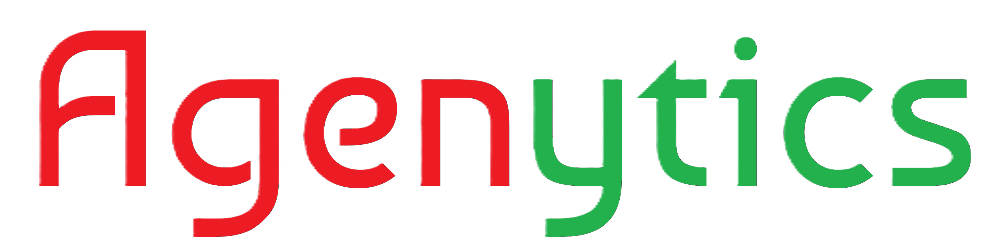

## 
 AI Agents Chat Starter Kit 

~~~~~~~~~ Made with ❤️ ~~~~~~~~~

 
---

For more information, visit our website: [agenytics.com](https://agenytics.com)

The Agenytics Starter Kit is a production-ready foundation for building AI agent chat applications. It was built using Laravel, Inertia, and Vue. It allows you to create both text-based chats and analytics-focused agent chats with ready-to-use UI components, including charts (powered by the [Apache ECharts library](https://echarts.apache.org/en/index.html)), tables, [Mermaid flow diagrams](https://mermaid.js.org/), code blocks, and more.

By default, the starter kit uses **n8n** as the agent builder. However, you are not limited to it—you can integrate any other agent builder. You can extend AiAgentInterface. The platform communicates with agent builders via ***REST API***, so as long as the agent responds in the predefined format, all features will work seamlessly. 

It can be used to build these example systems:

- Build RAG AI Chat
- Build Conversational BI (Business Intelligence)
     - Sales analytics chats
     - Financial reporting tools
     - Marketing performance analytics
     - CEO / CFO reporting chats

You can use Agenytics to:
- Create corporate AI Chat agents
- Launch SaaS products with built-in Stripe billing
- Accelerate freelance AI agent development and client projects

We look forward to seeing the great projects you build

Full documentation is available in: https://docs.agenytics.com/

Installation is available in https://docs.agenytics.com/local-setup#installation 

### Changelog

Please see [CHANGELOG](CHANGELOG.md) for more information what has changed recently.

## Contributing

Please see [CONTRIBUTING](CONTRIBUTING.md) for details.

### Security

If you discover any security related issues, please email muhammadumarsotvoldiev@gmail.com instead of using the issue tracker.

## Credits

-   [Muhammad Umar](https://github.com/MuhammadQuran17)
-   [All Contributors](../../contributors)

## License

The MIT License (MIT). Please see [License File](LICENSE.md) for more information.
